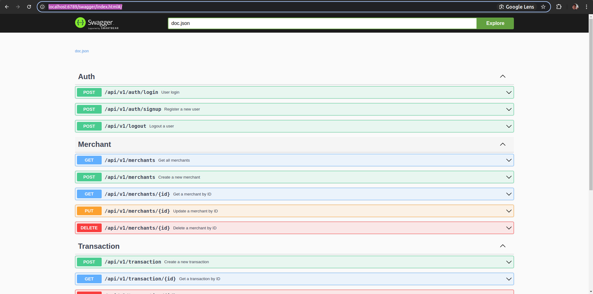

# REST API Bioskop Golang + Jwt Auth

Ini adalah sistem transfer sederhana yang dibangun menggunakan bahasa pemrograman Golang, menggunakan framework Gin untuk routing HTTP dan Gorm sebagai ORM nya.

# Instalasi dan Penggunaan

1. go mod tidy.
2. cp .env.example .env
3. Konfigurasikan file .env
4. Run dengan perintah go run main.go atau menggunakan compiler daemon dengan perintah compiledaemon --command="./golang-rest-api"

# Dokumentasi API (SWAGGER)

Dapat diakses di

```
http://localhost:6789/swagger/index.html#/
```



# Teknologi yang Digunakan

Golang
Gin
Gorm
bcrypt
godotenv
JWT (JSON Web Token)
Postgresql
Swagger
daemonCompiler
